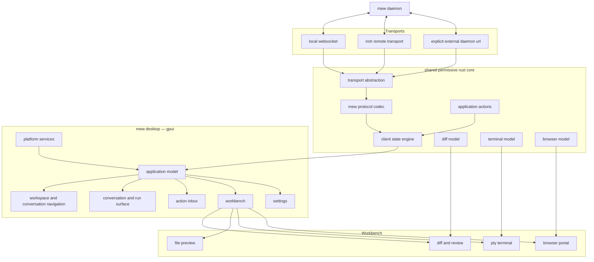
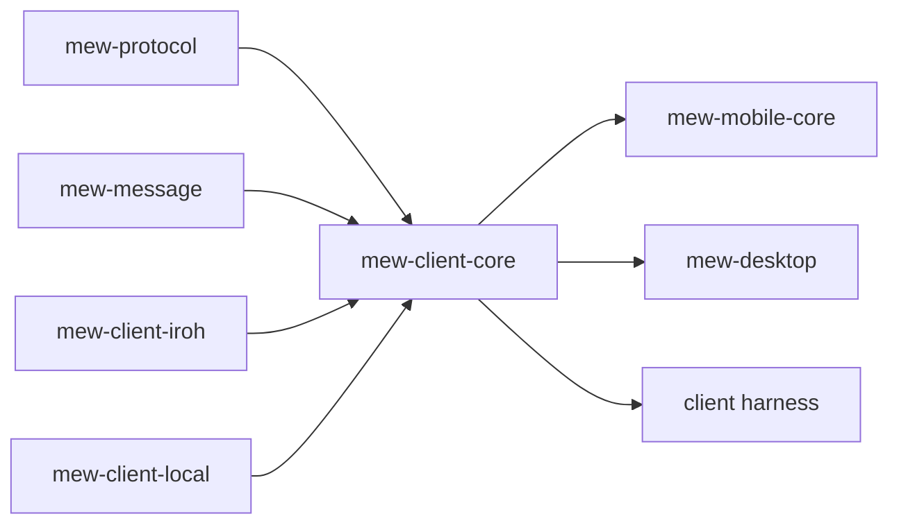
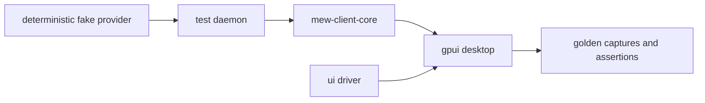

# final migration plan: tauri → gpui native desktop

the target is **a permissively licensed, native gpui desktop client built around the existing mew daemon and protocol**, with a focused code-review workbench rather than a general-purpose IDE.

the best way to “rip out tauri” is sequencing:

> build the gpui client beside tauri, reach functional parity, make gpui the default, then remove tauri and the React desktop shell.

deleting the current client first would force product redesign, protocol extraction, browser integration, packaging, and UI framework work to happen in one untestable branch.

## principles

1. **the daemon remains the product core.**
   the desktop app is a client and supervisor, not a second agent runtime.

2. **local and remote are transports, not separate application models.**
   use loopback WebSocket or a direct local transport for an app-owned daemon; use iroh for remote daemon connections. don’t force local traffic through iroh merely because it is available.

3. **workspace is the primary object.**
   conversations, files, diffs, terminals, browser tabs, and run history belong to a workspace.

4. **mew builds a reviewer, not an IDE.**
   excellent diffs, comments, patch actions, file preview, terminal, and external-editor handoff. no LSP or full editing platform in the first native release.

5. **no GPL-linked components.**
   gpui and every linked dependency must remain permissively licensed. zed is inspiration and behavioral reference only.

6. **native does not mean identical on every platform.**
   app state and semantic components are shared; menus, window behavior, shortcuts, notifications, and system integration adapt per platform.

---

## target architecture



the current mobile core already owns iroh connections, protocol decoding, assembled session state, and typed events, so the extraction starts from working code rather than a blank design.

---

# proposed repository layout

```text
apps/
  mew-desktop/
    Cargo.toml
    src/
      main.rs
      app.rs
      windows/
      views/
      components/
      platform/
      commands/
      assets/

crates/
  mew-client-core/
  mew-client-transport/
  mew-client-local/
  mew-client-iroh/
  mew-desktop-supervisor/
  mew-diff/
  mew-review/
  mew-terminal/
  mew-browser-host/
  mew-ui-model/
  mew-theme/

existing:
  mew-daemon/
  mew-protocol/
  mew-message/
  mew-config/
  mew-session/
  mew-mobile-core/
  mew-tui/
```

not every crate needs to exist immediately. the boundaries matter more than the exact count.

### `mew-client-core`

owns:

* protocol request/response dispatch
* connection status
* daemon snapshots
* sessions and workspace state
* model and persona state
* streaming message assembly
* permissions, questions, and plan approvals
* jobs and subagents
* reconnect and resubscription behavior
* typed commands and events

it must depend on neither gpui nor UniFFI.

### `mew-client-transport`

a narrow trait:

```rust
#[async_trait]
pub trait ClientTransport: Send + Sync {
    async fn connect(&self) -> Result<Connection>;
}

pub trait Connection: Send {
    async fn send(&mut self, message: ClientMessage) -> Result<()>;
    async fn receive(&mut self) -> Result<ServerMessage>;
    async fn close(&mut self) -> Result<()>;
}
```

implementations:

* local WebSocket
* remote iroh
* explicit `ws://` or `wss://` endpoint
* fake/in-memory transport for tests

### `mew-ui-model`

contains state that should behave identically across clients:

* selected workspace
* selected conversation
* workbench tabs
* action inbox
* navigation history
* command registry
* persisted layout
* notification policy

gpui views observe this model and emit actions. they should not perform protocol work directly.

---

# phase 0 — freeze the product model

before building views, write down the native desktop contract.

## workspace model

```rust
struct Workspace {
    id: WorkspaceId,
    root: Option<PathBuf>,
    display_name: String,
    conversations: Vec<ConversationId>,
    workbench: WorkbenchState,
}
```

support:

* filesystem-backed workspaces
* scratch workspace for cwd-less conversations
* multiple conversations per workspace
* workspace-scoped tabs and layout
* stable project identity when paths move, where practical

the existing web state stores one global workbench arrangement in local storage. the native client should avoid carrying that limitation forward.

## action model

unify these into one type:

```rust
enum RequiredAction {
    Permission(PermissionRequest),
    Question(QuestionRequest),
    PlanApproval(PlanProposal),
    GoalApproval(GoalProposal),
    Conflict(FileConflict),
    FailedRun(RunFailure),
}
```

every action has:

* workspace
* conversation
* originating turn
* severity
* timestamp
* response options
* resolved state

this powers both inline cards and the global inbox.

## run model

```rust
struct AgentRun {
    id: RunId,
    state: RunState,
    intent: Option<String>,
    activities: Vec<Activity>,
    changed_files: Vec<ChangedFile>,
    required_actions: Vec<ActionId>,
    result: Option<RunResult>,
}
```

messages remain available, but the UI organizes agent work around runs and outcomes.

### exit criterion

the object model is documented and represented by framework-independent Rust types with serialization and reducer tests.

---

# phase 1 — extract the shared client core

move the transport-independent parts of `mew-mobile-core` into `mew-client-core`.

the current mobile crate combines:

* iroh endpoint ownership
* registry persistence
* protocol transport
* state assembly
* typed event emission
* UniFFI exposure

those need separating.

## resulting dependency direction



## work

* extract lenient server-message decoding
* extract session-state assembly
* replace listener callbacks with typed event channels
* model outgoing operations as commands
* make reconnection transport-agnostic
* add snapshot restoration after reconnect
* preserve unknown protocol fields where possible
* make all state transitions deterministic and testable
* retain a thin UniFFI adapter in `mew-mobile-core`

### exit criterion

a headless test client can connect to a fake daemon, create a session, stream a response, receive a permission request, answer it, and restore state after disconnect.

---

# phase 2 — replace the tauri supervisor

the current Tauri shell does three major jobs:

* launches or attaches to a daemon
* owns remote-access configuration
* embeds and pumps CEF
* exposes those operations through Tauri commands

the supervisor already supports configured daemon URLs, app-owned daemon processes, bundled binaries, probing, logging, restart for remote mode, and shutdown ownership.

extract that into `mew-desktop-supervisor` without Tauri types.

## supervisor API

```rust
pub struct DesktopSupervisor {
    config: SupervisorConfig,
    child: Option<OwnedDaemon>,
}

impl DesktopSupervisor {
    pub async fn connect_or_launch(&mut self) -> Result<DaemonEndpoint>;
    pub async fn restart(&mut self, mode: DaemonMode) -> Result<DaemonEndpoint>;
    pub async fn shutdown(&mut self) -> Result<()>;
}
```

## daemon modes

* app-owned local daemon
* attach to existing local daemon
* configured WebSocket daemon
* paired remote daemon over iroh

## decisions

* keep the daemon out of process
* use an ephemeral local port by default rather than a fixed rendezvous port
* pass a random app-generated authentication token to an app-owned daemon
* store daemon logs through the platform path API
* never restart an externally owned daemon
* remote enablement is a connection profile, not a page reload

### exit criterion

a command-line harness using the extracted supervisor can launch, probe, connect to, restart, and shut down an app-owned daemon on each supported desktop platform.

---

# phase 3 — create the gpui shell

add `apps/mew-desktop` as a workspace member and pin gpui to an audited revision.

## first shell capabilities

* one main window
* native application menu
* command registry
* window state persistence
* platform keybindings
* theme tokens
* system appearance detection
* focus traversal
* text scaling
* crash-safe settings persistence
* single-instance behavior
* “open folder” and file-drop handling

## component foundation

build a small mew component library:

* button
* icon button
* text input
* multiline composer
* list row
* popover
* menu
* dialog
* split panel
* tab strip
* toast/status banner
* virtualized list
* scroll view
* code line
* empty state

do not reproduce shadcn component-for-component. build semantic controls needed by mew.

## platform layer

```rust
trait PlatformServices {
    fn open_external(&self, target: OpenTarget) -> Result<()>;
    fn reveal_in_file_manager(&self, path: &Path) -> Result<()>;
    fn notify(&self, notification: Notification) -> Result<()>;
    fn read_clipboard(&self) -> Result<ClipboardContent>;
    fn write_clipboard(&self, content: ClipboardContent) -> Result<()>;
    fn credential_store(&self) -> &dyn CredentialStore;
}
```

### exit criterion

the application launches, supervises the daemon, connects, shows connection state, handles menus, persists its window, and shuts down cleanly without React or Tauri participating.

---

# phase 4 — conversation vertical slice

this is the first genuinely usable native release candidate.

## navigation

left side:

```text
workspace switcher
needs attention
conversations
new conversation
```

rules:

* conversation ordering stays stable
* attention does not reorder the main list
* workspace and conversation titles are editable
* actions live in native context menus
* archived conversations are a filtered view
* global search is command-palette based

## conversation surface

* virtualized transcript
* streaming markdown
* code fences
* reasoning disclosure
* tool activity summaries
* error presentation
* copy and selection
* scroll anchoring that respects manual scrolling
* “jump to latest” affordance

## composer

* multiline input
* attachments
* paste images/files
* model and thinking selection
* persona selection
* send, queue, and cancel
* prompt history
* slash-command completion
* clear keyboard behavior shown inside the UI

## decisions

* desktop `enter` sends by default only if the product explicitly chooses that behavior; otherwise use `cmd/ctrl+enter`
* action requests render inline at their originating run
* one compact unresolved-action tray may remain near the composer
* cost and token telemetry moves to an inspectable session menu

### exit criterion

a user can perform normal mew work entirely in gpui:

* select a workspace
* start and resume conversations
* send prompts and attachments
* observe streaming
* answer questions and permissions
* switch models/personas
* cancel and retry
* recover after daemon reconnect

---

# phase 5 — native diff and review workbench

build this before terminal or browser. it is central to Codex-style feature parity and has fewer platform risks.

## `mew-diff`

framework-independent responsibilities:

* discover repository root and base revision
* compute file status
* parse rename/add/delete/binary states
* generate hunks
* line mappings
* intraline grapheme differences
* context expansion
* patch generation
* patch application and reversal
* detect stale source files
* map review comments across regenerated diffs where possible

use existing permissive dependencies where suitable; the repository already includes `similar` and `syntect`.

## review UI

* file navigator
* unified and split diff
* virtualized rows
* old/new line gutters
* syntax highlighting
* collapsed unchanged blocks
* keyboard file/hunk navigation
* line and range comments
* changed-file summary
* generated and binary-file treatment
* accessible text descriptions

## patch actions

* revert hunk
* revert file
* stage/unstage where supported
* copy patch
* ask mew to revise selected lines
* attach review comments to the next prompt
* open file and line in external editor
* reveal file in system file manager

## explicitly excluded

* freeform editing
* LSP
* autocomplete
* semantic navigation
* multicursor
* refactors
* extension system

### exit criterion

a user can inspect every change from an agent run, leave structured feedback, request a revision, revert unwanted hunks, and open a precise location externally.

---

# phase 6 — terminal and file surfaces

## terminal

implement a real PTY protocol; do not label job output as a terminal.

protocol needs:

* create PTY with cwd and environment profile
* attach/detach
* input bytes
* output bytes
* resize
* interrupt
* terminate
* exited status
* ownership and cleanup
* reconnection policy

desktop view needs:

* performant terminal grid
* copy/select
* links
* search
* scrollback
* shell integration later, not initially

jobs remain agent activities. a job can expose “open terminal” only when it has an interactive PTY.

## files

first release is read-only:

* tree
* fuzzy file picker
* syntax-highlighted preview
* line navigation
* find in file
* open externally
* pin file as conversation context
* external-change refresh

a constrained quick editor can be considered after the review workflow proves insufficient.

### exit criterion

workspace file inspection and real interactive terminal work no longer require the web client or an external terminal for routine cases.

---

# phase 7 — browser portal

this is the highest-risk surface and should not block the native conversation and review app.

the present browser host is explicitly macOS-first and embeds CEF as a native sibling to the Tauri webview. packaging, helper layout, sandboxing, and GPU behavior still require hardening.

## portal API

```rust
trait BrowserSurface {
    fn create(&mut self, owner: BrowserOwner, bounds: Bounds<Pixels>) -> Result<BrowserId>;
    fn set_bounds(&mut self, id: BrowserId, bounds: Bounds<Pixels>);
    fn set_visible(&mut self, id: BrowserId, visible: bool);
    fn navigate(&mut self, id: BrowserId, url: Url);
    fn focus(&mut self, id: BrowserId);
    fn close(&mut self, id: BrowserId);
}
```

the rest of the gpui app must not know about CEF handles.

## stage a — native child view

* reuse the existing CEF host/controller
* attach it to the platform window beneath or above an explicitly reserved GPUI region
* treat it as an opaque rectangle
* hide it before showing any overlay that would cross its bounds
* unify focus and keyboard routing
* expose URL/title/loading events as typed Rust events
* preserve the shared visible-browser/CDP session

## stage b — off-screen rendering

only pursue after stage a is stable:

* CEF OSR texture
* composite inside the GPUI render tree
* forward pointer, keyboard, IME, wheel, and focus events
* support correct clipping and overlays
* GPU acceleration and damage tracking
* accessible browser fallback strategy

## platform strategy

* macOS: existing CEF work first
* Windows: evaluate CEF child-window integration behind the same portal
* Linux: evaluate CEF/X11/Wayland realities separately
* unsupported browser surfaces must degrade clearly, not silently

### exit criterion

the user and agent control the same visible browser session, tab ownership is correct, window resize is stable, and browser failure cannot crash the main workspace.

---

# phase 8 — remote, iroh, and multi-device polish

iroh is already part of the workspace and mobile core. the work here is to make it a first-class desktop connection option, not merely transplant the mobile implementation.

## connection profiles

```rust
enum ConnectionProfile {
    LocalOwned,
    LocalExisting { endpoint: Url },
    RemoteIroh { daemon_id: DaemonId },
    RemoteWebSocket { endpoint: Url },
}
```

## features

* paired daemon registry
* secure token storage
* explicit trust and revocation
* connection status per daemon
* automatic reconnect with bounded backoff
* desktop notifications for remote required actions
* bandwidth-aware file and attachment behavior
* clear distinction between local file paths and remote files
* multi-client presence
* precise control/yield semantics backed by protocol messages

the existing “take control” behavior should not merely clear local presentation state; add an explicit protocol operation if exclusive or advisory control remains part of the product.

### exit criterion

the same desktop app can move between its app-owned local daemon and paired remote daemons without changing the rest of the application model.

---

# phase 9 — cutover and tauri removal

only now does “rip out tauri” happen.

## parity gate

gpui must support:

* daemon launch and attachment
* local and remote connection
* conversations and search
* models, thinking variants, and personas
* attachments
* streaming and cancellation
* permissions, questions, and plan/goal approval
* workspace file browsing
* diff review and patch operations
* terminal
* settings and themes
* native browser on the platforms currently promised
* packaging, updates, logging, and crash reporting
* accessibility and keyboard navigation
* migration of relevant desktop preferences

## cutover sequence

1. ship gpui as an opt-in binary, `mew-desktop`
2. run it against the same daemon and protocol as Tauri
3. migrate selected settings from web local storage
4. make gpui the default desktop build
5. retain one release with an explicit legacy-client fallback
6. freeze the Tauri client except for critical fixes
7. remove:

   * `mew-web-ui/src-tauri`
   * Tauri dependencies and scripts
   * `@tauri-apps/*`
   * sidecar packaging scripts made obsolete by native packaging
   * host invoke wrappers
   * WKWebView/CEF layering code
8. decide whether `mew-web-ui` remains as the browser client or is renamed to make its non-desktop role clear

the web client should probably remain. only the desktop use of it is being removed. it is already a distinct daemon client and may remain valuable for remote access and development.

---

# migration of existing code

## retain mostly intact

* daemon
* wire protocol
* message representation
* provider/runtime logic
* configuration paths
* session persistence
* CEF host core
* TUI
* mobile UniFFI facade
* theme manifest and generated semantic tokens

## extract and reshape

* mobile state assembler → `mew-client-core`
* Tauri supervisor → `mew-desktop-supervisor`
* browser ownership/controller → `mew-browser-host`
* web attention logic → shared action model
* workbench reducer concepts → `mew-ui-model`
* shared session search semantics → client core or UI model

## rewrite

* all React desktop views
* Zustand desktop state
* Radix/shadcn interaction components
* Tauri invoke/event bridge
* local-storage layout persistence
* web-specific keyboard routing
* fake header/status footer
* browser rectangle reporting from DOM bounds

the current React client detects Tauri and routes daemon and CEF operations through `invoke`, so that host abstraction becomes obsolete in the native client.

---

# commands and keyboard model

all actions should live in one typed command registry:

```rust
struct Command {
    id: &'static str,
    title: &'static str,
    context: CommandContext,
    default_bindings: Vec<KeyBinding>,
    handler: CommandHandler,
}
```

the same commands power:

* application menus
* command palette
* keyboard shortcuts
* context menus
* toolbar buttons
* accessibility actions

initial commands:

```text
workspace.new
workspace.open
workspace.switch

conversation.new
conversation.search
conversation.archive
conversation.rename
conversation.cancel_run

workbench.toggle
workbench.new_tab
workbench.close_tab

review.next_file
review.previous_file
review.next_hunk
review.comment
review.revert_hunk
review.open_external

terminal.new
terminal.interrupt

app.settings
app.command_palette
```

avoid independent global keyboard listeners scattered through views, which the React client currently uses for several workspace and tab operations.

---

# persistence

use versioned, atomic Rust persistence rather than browser local storage.

```text
config/
  settings.toml
  keybindings.json
  connections.json

state/
  window-state.json
  workspace-state/
    <workspace-id>.json
```

persist:

* window bounds and maximized state
* selected workspace/conversation
* workspace-scoped workbench tabs
* split sizes
* recent models
* connection profiles
* notification choices
* external editor preference

do not persist:

* unresolved permission responder closures
* raw credentials
* transient streaming buffers
* CEF native handles
* PTY handles

every persisted structure gets:

* schema version
* migration function
* malformed-data fallback
* atomic temporary-file replacement

---

# testing strategy

## core tests

* protocol fixtures
* reducer/state-transition tests
* reconnect behavior
* out-of-order and duplicate event handling
* unknown-message compatibility
* action resolution
* workspace mapping
* transport parity

## diff tests

* golden unified diff
* split-line mapping
* intraline differences
* renames and deletes
* binary files
* no-newline markers
* huge files
* stale patch rejection
* hunk and file reversal
* annotation remapping

## gpui tests

* deterministic component snapshots where supported
* keyboard traversal
* command routing
* focus restoration
* modal behavior
* list virtualization
* narrow and wide layouts
* high-DPI rendering
* light and dark themes
* reduced motion

## integration harness



reuse the fake-provider strategy already used by the web end-to-end tests, but do not copy their selectors or outdated assumptions about the old header-based UI.

## CI matrix

* macOS arm64
* macOS x86_64 where still supported
* Windows x86_64
* Linux X11
* Linux Wayland where feasible

each platform runs:

* compile
* unit tests
* headless client integration
* packaging smoke test
* launch/connect/shutdown smoke test
* license audit
* dependency vulnerability audit

CEF tests may require dedicated runners and should be isolated from the normal UI suite.

---

# licensing guardrails

add an automated policy before new UI dependencies spread.

## allowlist

* MIT
* Apache-2.0
* BSD-2-Clause
* BSD-3-Clause
* ISC
* Unicode licenses
* similarly permissive licenses after review

## process

* `cargo deny` license policy
* generated dependency/license report per release
* source-header check for imported code
* no copying from Zed files without verifying their exact license
* design descriptions are fine; copied implementation is not
* document provenance for adapted algorithms or assets

keep gpui behind a mew-owned component and platform abstraction so replacing or upgrading it does not infect the application model.

---

# major risks

| risk                                          | mitigation                                                |
| --------------------------------------------- | --------------------------------------------------------- |
| gpui API churn                                | pin a revision; isolate it behind mew components          |
| simultaneous architecture and UX rewrite      | ship vertical slices against the existing daemon          |
| browser blocks all progress                   | defer it until conversation and review are native         |
| client core becomes another giant state store | typed domain modules and reducer tests                    |
| platform behavior diverges                    | shared commands/models, platform-specific services        |
| full editor scope creep                       | define review and external-editor handoff as the contract |
| remote paths treated like local paths         | explicit workspace origin and file capability model       |
| CEF crashes or hangs the app                  | isolate lifecycle, watchdog, graceful unavailable state   |
| protocol changes break older clients          | capability negotiation and tolerant decoding              |
| cutover loses users’ state                    | versioned migration and one-release fallback              |

---

# the first implementation sequence

## pr 1 — client-core extraction

* create `mew-client-core`
* move session state and protocol assembly out of mobile core
* add fake transport and lifecycle tests
* adapt mobile core to consume it
* no behavior change

## pr 2 — native supervisor extraction

* create `mew-desktop-supervisor`
* remove Tauri types from daemon launch logic
* add ephemeral port and app-owned authentication token
* build command-line supervisor harness
* keep Tauri consuming the extracted supervisor temporarily

## pr 3 — gpui bootstrap

* add `apps/mew-desktop`
* open native window
* command registry
* settings and window persistence
* connect through client core
* render daemon connection state

## pr 4 — workspace and conversation navigation

* workspace model
* conversation list
* create/attach/archive
* stable attention inbox
* search command

## pr 5 — native transcript and composer

* streaming transcript
* markdown
* composer
* model/persona controls
* cancel
* attachments

## pr 6 — required-action flow

* permissions
* questions
* plan and goal approvals
* global inbox
* native notifications

## pr 7 — diff model and first review surface

* changed-file list
* unified diff
* syntax highlighting
* hunk navigation
* external-editor handoff

after that, proceed to patch actions, terminal, browser, remote polish, and cutover.

---

# definition of done

the project is complete when:

* the default desktop app contains no Tauri or webview dependency
* the linked desktop binary contains no GPL component
* the daemon and protocol remain shared across desktop, TUI, mobile, and web
* local and iroh-connected daemons use one application state model
* workspace and conversation navigation are coherent
* required actions have one consistent presentation
* diff review is sufficient for routine agent work without opening an IDE
* external-editor handoff is excellent when manual editing is needed
* the terminal is a real PTY
* the browser is an isolated portal, not a layout hack
* macOS, Windows, and Linux have native menus, shortcuts, packaging, and lifecycle behavior
* the Tauri shell and its browser-layering machinery have been deleted

the first durable milestone is not “gpui renders a window.” it is **a gpui conversation client running against the real daemon through a newly shared client core**. everything after that becomes incremental rather than existential.
